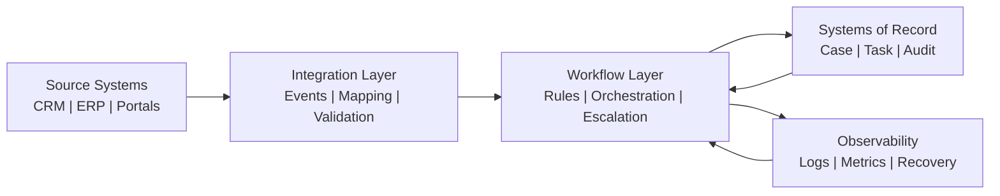

# Architecture Notes

## Core layers

### 1. Source systems

The source layer includes operational systems that emit records, events, or requests.

### 2. Integration layer

The integration layer performs validation, mapping, deduplication, and transport handling.

### 3. Workflow layer

The workflow layer coordinates business state transitions, approvals, escalations, and task progression.

### 4. System-of-record layer

The system-of-record layer captures authoritative task, case, and audit state.

### 5. Observability layer

The observability layer supports monitoring, incident response, and replay-safe recovery.
